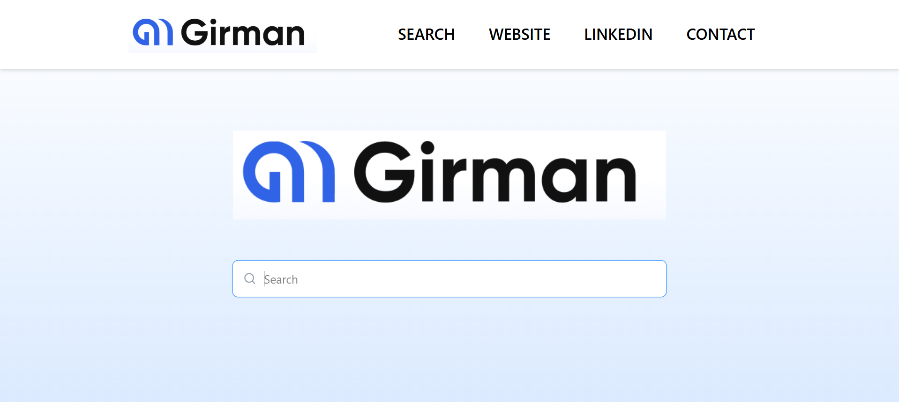
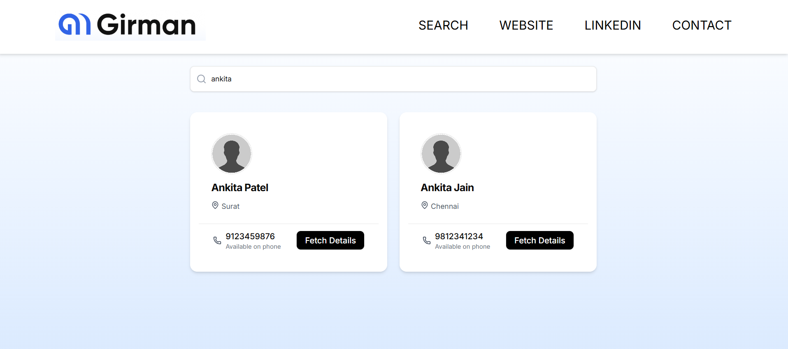
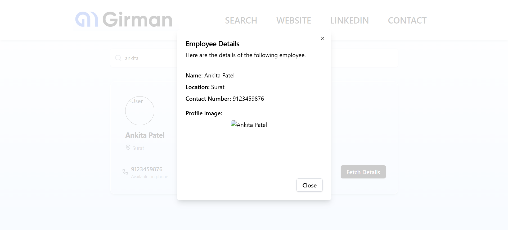
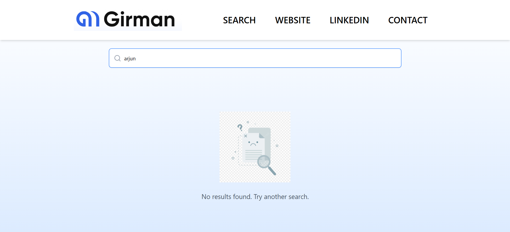
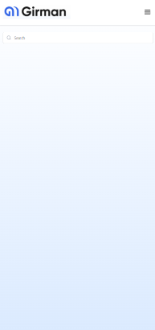
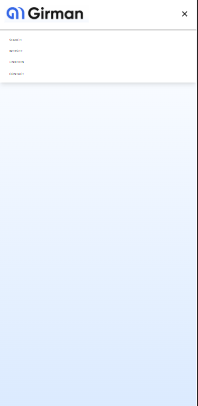
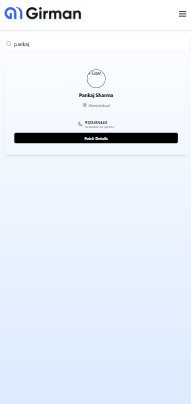
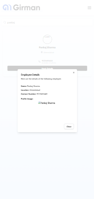
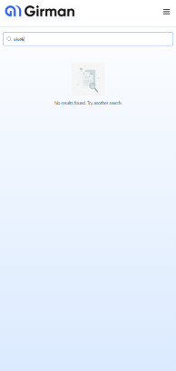

# Girman Search App

A responsive employee search application built with **React, TailwindCSS, Shadcn/ui**, and deployed on **Netlify**.  
The app allows users to search employees, view details in cards, and fetch more details using dialogs.

---

## 🚀 Features

- 🔍 **Search functionality** – Easily find employees.  
- 📱 **Responsive design** – Mobile-friendly navigation and layouts.  
- 🧩 **Reusable components** – Built with shadcn/ui and TailwindCSS.  
- 🖼 **User cards** – Display employee info with profile images.  
- 🗂 **Dialog modal** – View detailed employee information.  
- 🌐 **Deployed on Netlify** – Live and accessible online.  
- 📦 **Code hosted on GitHub**.

---

## 🛠️ Tech Stack

- **React JS**
- **React Router DOM**
- **TailwindCSS 4**
- **shadcn/ui** (Radix-based UI components)
- **Lucide React** (icons)
- **Vite** (build tool)
- **Netlify** (deployment)

---

## 📸 Screenshots

### Home Page


### User Card


### User Dialog


### No Result Page


### Phone view home page


### Phone view nav bar


### Phone view user card


### Phone view dialog box


### Phone view no result page



---

## ⚙️ Installation & Setup

1. Clone the repository:
   ```bash
   git clone https://github.com/your-username/girman-search-app.git
   cd girman-search-app
   ```

2. Install dependencies:
   ```bash
   npm install
   ```

3. Run the development server:
   ```bash
   npm run dev
   ```

4. Build for production:
   ```bash
   npm run build
   ```

5. Preview production build:
   ```bash
   npm run preview
   ```

---

## 🌍 Deployment

This project is deployed on **Netlify**.  
You can try it live here: [Netlify App Link](https://magenta-croissant-e481c5.netlify.app/)

---

## 📂 Project Structure

```
src/
 ├── components/
 │    ├── Navbar.tsx
 │    ├── UserCard.tsx
 │    ├── UserDialog.tsx
 │    └── ui/ (shadcn components)
 ├── pages/
 │    ├── Home.jsx
 │    └── SearchResults.tsx
 ├── App.jsx
 └── main.jsx
```

---

## 🤝 Contributing

Pull requests are welcome!  
For major changes, please open an issue first to discuss what you’d like to change.

---

## 📜 License

This project is licensed under the MIT License.
